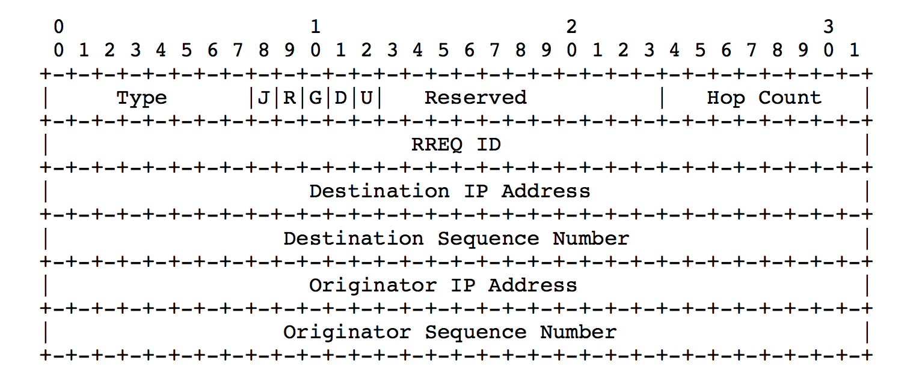
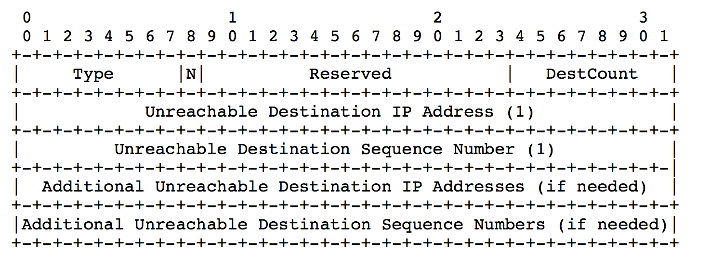

# AODV RFC 阅读笔记

## Feature

- 能快速获取新目的地路由
- 无须维护到未处于活跃通信中的节点的路由
- 连接中断时，通过通知受影响的节点集合来让使用了断开的链接的路由时效
- 每条路由表项使用一个目的端序列
- 目的端序列号由目的节点和目的节点发送给请求节点的路由信息共同生成
- 目的端序列号避免了环的产生，易于实现
- 请求节点需要选择最好的序列号
- 基于UDP，port：654

## Principle

- 消息类型：RREQ，RREP，REER
- 通信两端的有效路由互相包括对方时，AODV没有任何作用
- 需要新目的端的路由时，广播RREP找到目的地路线，当RREQ到达目的地或到达具有到目的地Fresh enough的中间节点，可以确定路线。通过RREP单播回到源端可以获得路由，接收请求的每个节点缓存返回给源端的路由，由此单播返回
- 检测到活跃路由中的链路断开时，用RERR通知其它节点该链路丢失了，RERR消息指出了由于已断链路不再可达的目的地或是子网，为了实现这种机制，每个节点需要包含它的前项节点，以及它的可能用到作为下一条的邻居节点的IP，该消息可以通过RREP的迭代得到。如果RREP有非零前缀长度，那么源端也包含在子网的前项列表里。
- 序列号由起始节点主导

## Message format

### RREQ

- Type: 1
- J: Join flag; reserved for multicast.
- R: Repair flag; reserved for multicast.
- G: 冗余 RREP 标识.
- D: Destination only flag.
- U: Unknown sequence number.
- Sequence number: RREQ ID，用序列和IP唯一标识源端
- **Originator sequence number**: 这个序列将用于路由表项中，指向路由请求的发起端
- **Destination sequence numbe**r: 源端过去收到的指向目的端的最新序列号

### RREP

- Type: 2
- R: Repair flag; used for multicast.
- A: Acknowledgment required.
- Prefix Size: 非0情况下这5bits表示下一跳可以被拥有相同前缀的节点使用
- Lifetime: 被RREP认为有效的时间

### RERR

- Type: 3
- N: 本地修复，上游节点暂时不要删除
- DestCount: 消息中包含的不可达节点，至少为1
- Unreachable Destination Sequence Number：路由表项中之前的目的端不可达的目的端序列号

### RREP-ACK

- Type: 4

## Operation

### 管理序列号

每个节点的路由表项都必须包括最新的目的地序列号(包括IP消息)，当一个节点从RREQ，RREP，RERR收到关于目的地的新的消息时，目的端序列号更新。AODV通过目的端序列号来避免成环。**以下情况目的端节点会更新它的序列号**：

- 当一个节点发起路由发现时，它必须增加序列号。这避免了与先前发起RREQ的源端建立反向路由时的冲突。
- 当一个节点对RREQ发起RREP回复时，它必须将它的序列号更新为RREQ里的序列号和目的地序列号中的最大值。

序列号大小的比较：为了防止翻转带来的影响，比较时将序列号视为32位无符号整数，节点用从AODV消息中收到的序列号减去当前序列号，如果差值小于0，则丢弃AODV消息中与目的端相关的信息，因为它不是新的。

唯一一种例外状况是，一个节点可能改变路由表中的某条表项的目的端序列号来响应到达目的端的下一跳丢失或是失效。节点通过查询路由表中的特定下一跳来查找目的端。在这种情况下，每个用到丢失的这一跳的目的端节点会增加序列号，并将路由设为不可用。当包含受影响的目的端的足够新鲜的路由消息被标记了路由项不可用的节点收到时，节点会据此更新路由消息。**节点在以下情况会改变目的端相关的路由表项的序列号**：

- 自己是目的节点，并能提供到自己的新的路由
- 收到关于目的端的新的序列号的AODV消息
- 到达目的端的路径断了或是到期了

### 路由表和前项列表

当一个节点收到来自邻居的AODV控制消息，或是新建或更新了到达某一特定目的端或是子网的路由时，它会检查路由表中的到那个目的端的表项。如果没有目的端的表项，就创建一个。序列号由包含了control packet的消息决定，或是将Sequence Number Field设为false。路由仅在以下情况下更新：

- 新的序列号比路由表中的目的端序列号高
- 序列号相等，但是跳数+1比路由表中的存在的跳数多
- 序列号未知

路由表项的Lifetime要么由Control packet决定，要么初始化为ACTIVE_ROUTE_TOMEOUT, 这个路由现在可以用于发送任何包和路由消息。每次使用路由转发数据包时，路径的源端、目的端、下一跳的Active Route Lifetime域会被更新为大于等于当前时间加上ACTIVE_ROUTE_TOMEOUT。由于源端和目的端之间的路由应是对称的，前一跳的Active Route Lifetime以及指向源端IP的反向路径也应该作出这样的更新。无论是目的端是一个子网还是单一节点，当使用路由时，Active Route的Lifetime都会更新。每个节点维持有效路由的路由表项，同时也维持一个前项列表用于在路由上转发packet。当节点侦查到下一跳丢失的时候，这些前项会收到通知。路由表项的前项列表包含了发起或是转发路由回复的邻居节点。

### 发起路由请求

当一个节点确定了自己需要一条到达目的端的路由但是还没有可行的路由的时候，它会传播一个RREQ消息。具体来说就是这种情况，如果一个目的端之前对于一个节点来说是未知的，或者之前到达目的端的有效路由到期或者是失效了。RREQ消息的目的端序列号是最新知道的目的端序列号，它是从路由表的目的端序列号域复制过来的。如果没有已知的序列号，就将Unknown Sequence Number标志置1。RREQ消息的源序列号是节点自己的序列号，它在插入一个RREQ之前或自动增加。RREQ ID域在上一个在当前节点使用的上一个RREQ ID之上+1，每个节点都只有一个RREQ ID，Hop Count 域置零。

在广播RREQ之前，源节点缓存RREQ ID和它自己的IP地址用于PATH_DISCOVERY_TIME，这样，当一个节点多次收到来自邻居的同一个包时，它就不会重复处理和转发。

源节点被期待与目的节点能有双向通信。为完成这个目标，任何中间节点的生成用来传递给源节点的RREP必须被一些action完成，即告诉目的节点一条回到源节点的路由。具体实现是通过设置G flag。

一个节点每秒发送的RREQ不能超过RREQ_RATELIMIT条，在广播RREQ之后，节点等待RREP或者是其他带有关于目的节点的路由的当前控制消息。如果在NET_TRAVERSAL_TIME毫秒内节点没收到任何消息，节点可能会再次尝试广播RREQ来发现路由，这取决于在最大TTL值下的RREQ_RETRIES次数的上限。每次新的尝试都应该增加并更新RREQ ID，每次尝试IP首部的TTL field根据特定机制来设置(下文详述)，这是为了能控制每次重发中RREQ的转发距离。

等待路由的数据包应该被缓存(例如发送出一个RREQ之后等待RREP)，该缓存为FIFO。如果超过最多尝试次数都没有收到，所有和目的端相关的数据包都应该被丢弃，目的端不可达消息会被传送。

为了解决网络拥堵，源端发起的对单个目的节点的路由发现尝试必须使用用二进制指数回退方案，即等待时间逐次乘2。

### 路由请求消息的传播控制

为了避免不必要的RREQ在网络范围内的传播，源端必须使用扩展环搜索技术，即源端在RREQ包的IP head初始化TTL = TTL_START，设置接收RREP的timeout为RING_TRAVERSAL_TIME，用于计算RING_TRAVERSAL_TIME的TTL_VALUE设为与IP首部的TTL field的值相等。如果RREQ超时，将TTL加上TTL_INCREMENT重新广播RREQ, 直到RREQ的TTL设置到达TTL_THRESHOLD，超过的时候就使用TTL = NET_DIAMETER，每次timeout都为RING_TRAVERSAL_TIME。当所有重试需要遍历整个ad hoc网络时，可以通过配置TTL_START和TTL_INCREMENT与NET_DIAMETER相等来实现。

存储在无效路由表条目中的Hop Count表示最后一次知道的路由表中到目的端的跳数，如果之后需要到达这个目的端的新的路由，RREQ的IP首部TTL会被初始化为Hop Count + TTL_INCREMENT。然后每次超时TTL都会增长TTL_INCREMENT直到TTL到达TTL_THRESHOLD。超过之后TTL会被设为NET_DIAMETER，timeout设为NET_TRAVERSAL_TIME。

到期路由表项在current_time + DELETE_PERIOD之前不应被立即抹去，否则，与路由有关的soft state会丢失，另外，长路由表项抹杀时间也许会被配置，任何等待RREP的路由表项在(current_time + 2 * NET_TRAVERSAL_TIME)前不应被抹去。

### 处理和转发路由请求

当一个节点收到RREQ，它首先新建或是更新到达前一跳的路由，这个路由不带有效序列号；然后检查它是否曾在上一个PATH_DISCOVERY_TIME内收到了有着同样源IP地址和RREQ ID的RREQ。如果有收到，丢弃新收到的RREQ。对于没被丢弃的RREQ：

1. RREQ的hop count加一；
2. 节点用最长前缀匹配搜索到达源IP的反向路由。如果需要，用路由表中RREQ的源序列号创建或是更新路由。
3. 当节点收到要返回给发起RREQ的节点的RREP，反向路由就会被需要。

当反向路由创建或是更新，以下路由动作会被执行：

- RREQ的源端序列号与路由表项中的相关目的端序列号进行比较，如果大于现有值就复制；
- valid sequence number field 设为真
- 路由表中的下一跳设为发送RREQ的节点(由IP首部中的源IP地址得到，一般不等于RREQ中的源IP地址)
- hop count从RREQ消息中的Hop Count字段复制过来

当RREQ被接收，源IP地址的反向路由表项的Lifetime被设置为max(ExistingLifetime, MinimalLifetime)，当前节点可以使用反向路由转发数据包。

如果一个节点并没有发起RREP并且收到的IP header的TTL大于1，节点更新并广播RREQ到每个配置接口上。为了更新RREQ，发出的IP首部的TTL或者hop limit应该减1，为了通过中间节点计算新的一跳。最后，目的端序列号设为收到的RREQ消息中有关值的最大值。目的端序列号仅由请求目的端的节点维持，转发节点不能修改目的端序列号，即使收到的RREQ的值比当前当前转达节点中的值大。

否则，如果一个节点并没有发起RREP，那么节点转发RREQ，*需要注意的是，中间节点如果向每一个RREQ的转发回复一个特定的目的端，它可能会变成目的端没有收到任何发现消息。*这种情况下，目的端没有从RREQ消息中学习到到达源端的任何路由，可能会导致目的端发起路由发现。为了目的端能够学习到到达源端的路由，在目的端可能需要到达源端的路由时，无论出于什么原因，源端节点都需要在RREQ里设置G flag。为响应设置了G flag的RREQ，中间节点会返回RREP，并单播一个无目的的RREP给目的端节点。

### 发起路由回复

节点在以下情况下发起RREP:

- 自己是目的端
- 有到达目的端的活跃路由，在节点的现有路由表中目的端序列号有效并且比RREQ的目的端序列号要大，同时destination only（D）flag未被设置。

当发起路由回复时，节点从RREQ复制目的端IP和源端序列号到RREP的相关域里。处理过程根据节点是被请求的目的端还是拥有足够新鲜的到达目的端路由的中间节点而有所不同。只要被创建，RREP就通过单播到下一跳就是RREQ源端的节点，就像被发起者路由表项指出的的那样。hop counter指出了这个过程的距离。

#### 目的端的路由回复

- **回复消息中将RREQ中的序列号加1**——假如RREQ包序列号等于增加后的值。否则，目的端在发起RREP前并不改变序列号。目的端将它的序列号放到回复消息中的Destination Sequence Number域里，将hop count域里置零。
- 目的端复制MY_ROUTE_TIMEOUT到RREP的Lifetime域里。每个节点可能会根据掩码限制和MY_ROUTE_TIMEOUT重置他们的值。

#### 中间节点的路由回复

- 如果是路径上的中间节点，将它已知的目的端序列号复制到RREP的Destination Sequence Number域里。
- 通过将上一跳节点放进路由表中的前置列表来更新路由表项，同时也根据反向路由表项的前置列表中将通往目的节点下一跳更新路由表中关于发起RREQ的节点的表项。
- 更新RREP的Count域：放置到达目的端的跳数。
- 更新LIfetime域：路由表中的超时时限 - 当前时间

#### 生成冗余的的RREPs

- 当节点收到回应RREQ的RREP时，丢弃RREQ
- 如果G flag被设置，中间节点给源端发RREP，同时单播一个冗余的RREP给目的端，这个冗余消息包括：
  - hop count
  - 目的端IP - RREQ里的源端
  - 目的端序列号 - RREQ里的源端序列号
  - 源端IP - RREQ目的端IP
  - Lifetime - 中间节点一直的剩余有效时长

> 等于告诉目的端我之前向谁回了什么主要信息

### 收到和转发路由回复

当节点收到RREP消息，就用最长匹配前项来搜索路由表中的前一跳，必要的话会为前一跳创建一个路由，但是没有有效序列号。然后，节点将RREP中的hop count加1，为了通过中间节点来找到新的一跳。增加后的hop count被称为New Hop Count如果到目的地(新的一跳还是最终目的端？)的路由不存在就创建一个，另外。节点会用自己存储的目的端序列号比较消息中的目的端序列号，已存在的路由表项仅在以下情况下更新：

- 路由表项中的序列号被标记为无效
- RREP中的目的端序列号优于节点中的其它目的端序列号的拷贝，并且有效
- 序列号相同，但是路由被标记为不活跃
- 序列号相同，但是New Hop Count比路由表中的跳数要小

到目的地的路由表项创建或者更新时将会执行以下操作：

- 路由被标记为活跃
- 目的端序列号标记为有效
- 路由表中的下一跳指定为发送RREP的节点，这在IP首部的源IP地址中标明了
- 跳数设为New Hop Count的值
- 超时时间设为现在时间加上RREP的Lifetime
- 目的端序列号设为RREP中的目的端序列号

> 如我所想，这是一个反向路由的记录，但是因为这是回复消息，所以发起者是目的端

然后，这个节点就可以用来转发到达目的端的数据包了。

如果转发RREP的节点从一条可能出现差错或是单向链路上转发了RREP，这个时候节点应该设置A flag来要求RREP的接收者在确认RREP之后回传一个RREP-ACK。

当节点传送RREP时，相符的目的端节点的前项列表这样更新：给自己增加RREP的下一跳的节点。同时，用于转发RREP的反向路由将自己的lifetime变为当前lifetime和现在时间+timeout两者的最大值。

### 单向的链路上的操作

RREP的传送可能失败，尤其是在单向链路上的RREP。如果没有其他的从同一路由发现产生的RREP到达发起RREQ的节点，RREQ的源节点会在timeout之后重新发起一个路由发现，但是只是无用的尝试罢了。在AODV中，只处理第一份有同样RREQ ID的消息。假设第一个RREQ沿着单向链路到达了，接着另一个RREQ通过一个双向链路到达了，但是被忽视了。

为了防止这个问题，当节点发现它发的RREP消息传送失败了，它会将失败RREP的下一跳加入**黑名单**。这样的错误可以被链路层或是网络层的 **ACK机制** 发现。节点忽视所有的黑名单列表的RREQ，当经过“黑名单时间”后，节点才会从黑名单消失。

RREP-ACK **不会包含** 它确认的是哪一个RREP消息，**因为它只是说明链路是双向的**。

### Hello Message

见队友笔记

### 维持本地连接

每个转发节点都应该追踪它和活跃下一跳们的持续连接，机制如下：

- 任何适合的链路层通知都能用来确定连接，例如，链路层ACK丢失，或是发送RTS后没有收到CTS并过了最多重发次数，就指明到下一跳的链路丢失。
- 如果第二层通知不可行，使用被动确认。如果下一跳是要转发包的，侦听信道，看下一跳是不是转发了。如果没有，或者下一跳已经是终点了，为确定连接执行以下方法之一：
  - 接收下一跳的任何包，包括hello
  - 单播RREQ给下一跳，消息包括询问到下下一条的路由
  - 单播给下一跳一个ICMP echo request

如果这些方法都不能检测到到下一跳的连接，就认为连接丢失。

### RERR消息，路由超时和路由删除

路由错误和连接断开的一般处理：

- 现有路由设为失效
- 列出受影响的目的端
- 确定是否有哪些邻居受影响
- 给受影响邻居发送RERR

节点发送RERR的速率受限于RERR_RATELIMIT每秒。

节点在以下三种情况下开始建立RERR消息：

- 在发送数据的时候检测到到下一跳链路断开，并且修复不成功
- 得到一个发送给没有活跃路由的节点的数据包，并且同样不可修复
- 从邻居哪里收到RERR

