# RERR源码阅读

首先我们回顾一下RERR的消息格式：


相应的，`aodv_rerr.h` 文件里定义了RERR的消息格式：

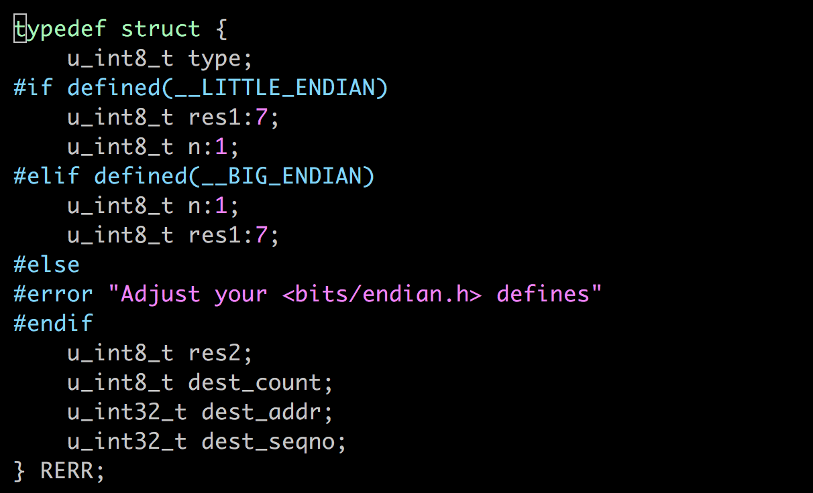

RERR里面可选的不可达目的端放在了另外一个结构体中：

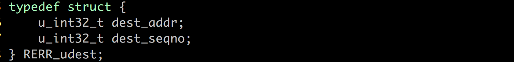

RERR主要实现了三个函数：

- rerr 的创建
- 不可达节点的添加
- rerr 的处理

## 创建RERR

```c
RERR *NS_CLASS rerr_create(u_int8_t flags, struct in_addr dest_addr,
                             u_int32_t dest_seqno);
```

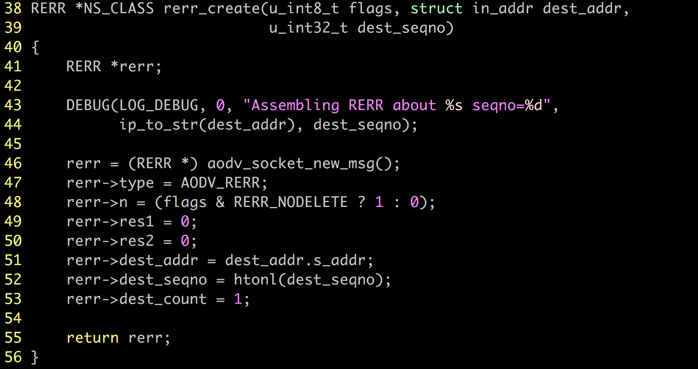

- 41~46: 创建一个初始化的RERR消息，并写入日志
- 47~53：根据参数给RERR消息赋值，其中48行是本地修复标记，这个标识若为1说明上游节点暂时不能删除它。
- 55：返回RERR指针


## 添加不可达列表

```c
void NS_CLASS rerr_add_udest(RERR * rerr, struct in_addr udest,
                               u_int32_t udest_seqno);
```

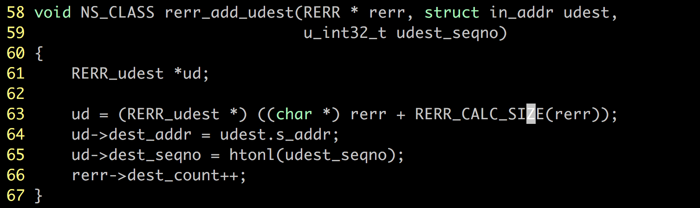

- 61：创建RERR_udest变量ud
- 63: ud指向的消息为RERR加上自己的大小(包含了不可达节点)


这个宏用来计算概念上的rerr大小，因为rerr的实现被分为了两个结构体，因此要将它们一起算进去。

- 64~66：赋值给ud指向的消息，递增rerr的目的端计数器。


## RERR处理

```c
void NS_CLASS rerr_process(RERR * rerr, int rerrlen, struct in_addr ip_src,
                             struct in_addr ip_dst);
```

这是一个复杂的函数，要处理很多事情，如路由项的检查，序列号的比较，更新序列号，创建rerr，发送新的rerr，确定是否单播。下面我们省略初始化，从长度检测开始顺序分析。

### 异常处理

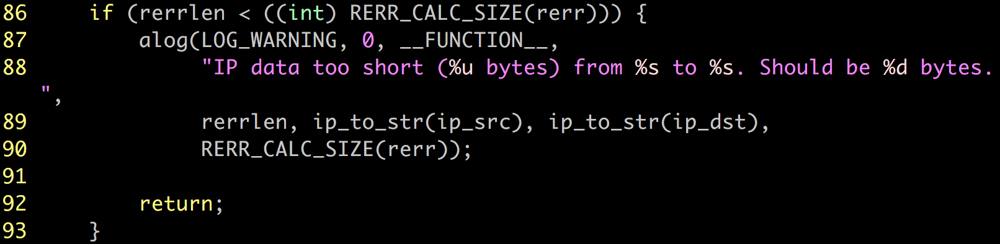

检查rerr的长度，它不应小于rerr的大小，否则写入错误日志，程序返回。

### 检查不可达目的端

根据需要可能要创建新的rerr，更新路由表项。

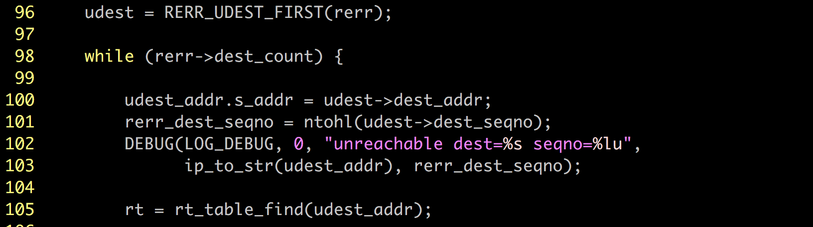

- 96: 进入循环前使用宏提取出rerr的目的端（非 add 部分），赋值给udest
- 98~105：rerr保存的目的端总数多于0的情况进入循环，将相关参数赋值给变量，记录日志，105是保存了目的端为udest的表项。

当路由表中有到udest的有效表项，并且这个表项的下一跳的ip地址和参数源ip的IP地址相同时，进出处理statement：

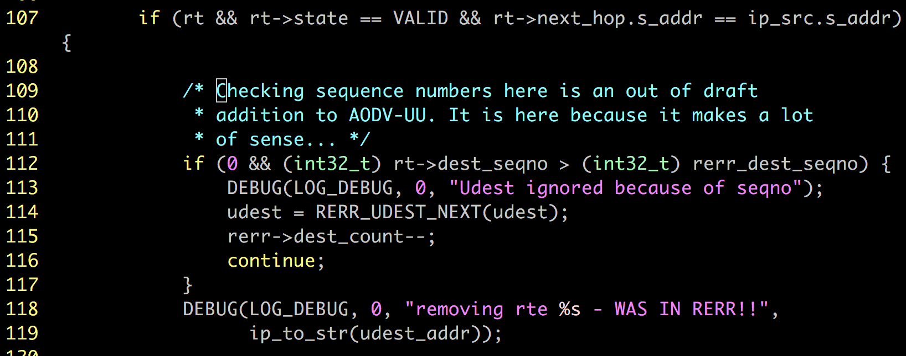

- 112~117：作者本意应该是检查一下序列号是不是不符合AODVUU的附加标准，但因为不可告人的原因这又是一段不会被执行的代码=、=
- 118~119：写日志

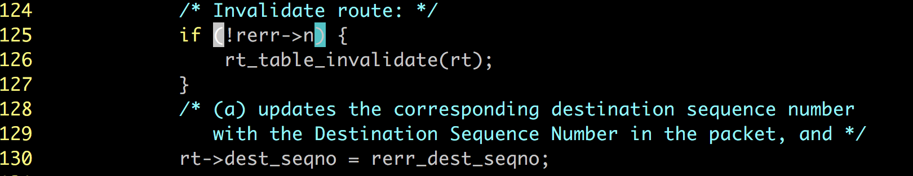

- 125~127: 如果n flag没被设置，就让到不可达目的的路由失效。
- 130：更新路由表项的目的端序列号

检查前项列表是否为空，如果没有空并且没有设置本地修复的标记：

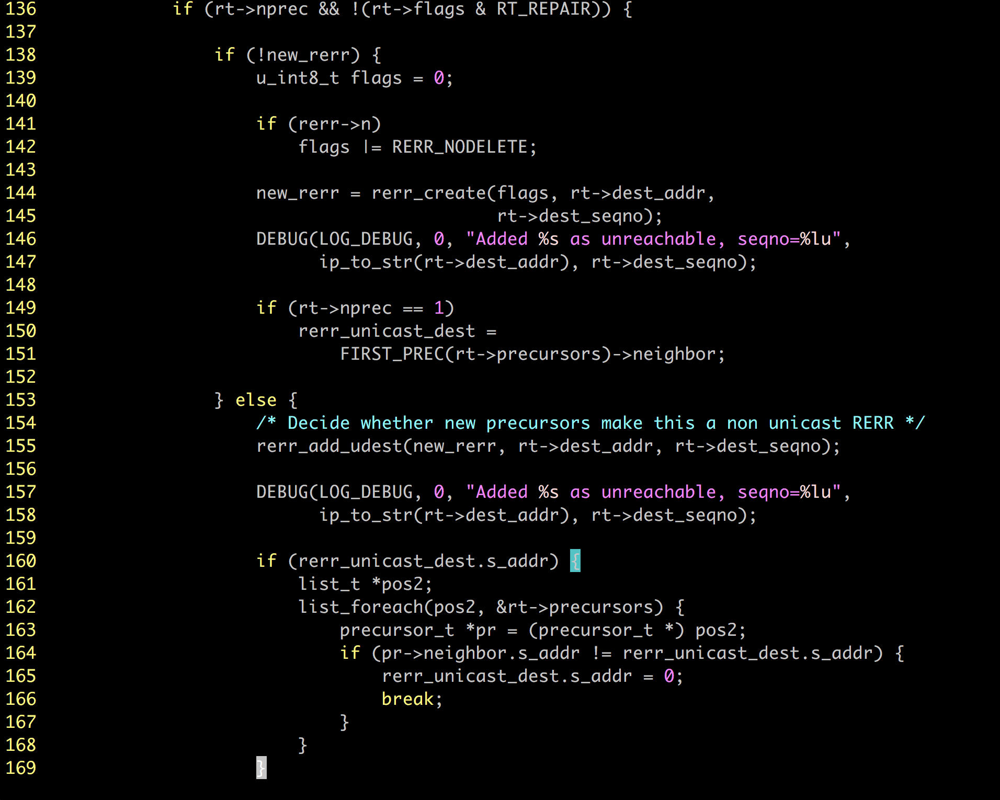

- 138~151：新建一个rerr，n flag设为和rerr一样，写入日志，路由表项的前项唯一，就将rerr单播地址设为路由表项的第一个前项的邻居。
- 154~171：如果新的rerr已存在，给它添加路由表项的目的端和序列号，写入日志。如果rerr单播地址非空，遍历路由表项的前项，只要存在与rerr单播目的地不一样的邻居ip，就将rerr的单播目的端地址设置为0. 因为只要存在这一的异端邻居，就能确定这个rerr是从哪里开始被指定单播过来的了，但奇怪的是，这里并没有给出任何后续处理。

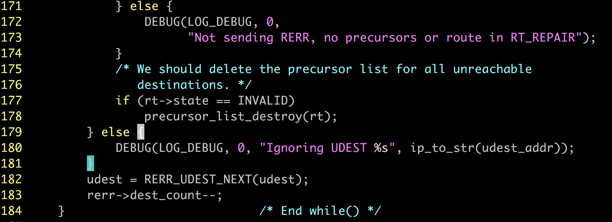

- 171~174：如果没有前项路由和修复标志，写入debug日志。
- 177~178：如果路由表项无效，删除它。
- 179~181：如果不满足路由表中有到udest的有效表项，并且这个表项的下一跳的ip地址和参数源ip的IP地址相同，写入debug日志。
- 182~183：更新循环条件，dest_count递减（因为处理过了）

### 发送新的RERR

如果检查阶段创建了新的rerr，这里进行发送处理

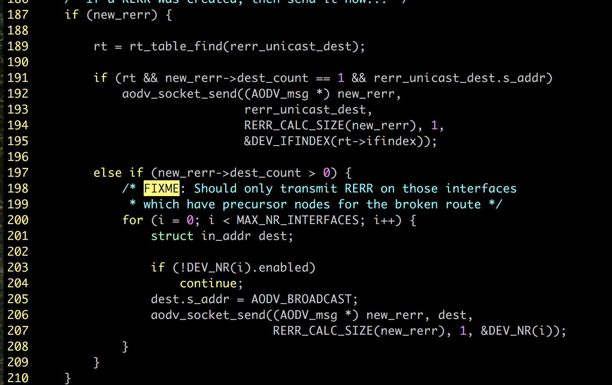

- 189：找目的端为单播目的的路由表项
- 191~196：如果存在这样的表项并且即将发送的rerr确实是单播，地址也有效，那么调用函数进行发送。
- 197~207：如果rerr目的端不止一个，就进行广播，广播消息数量是当前主机的允许设备数。