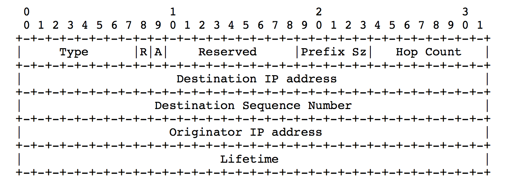
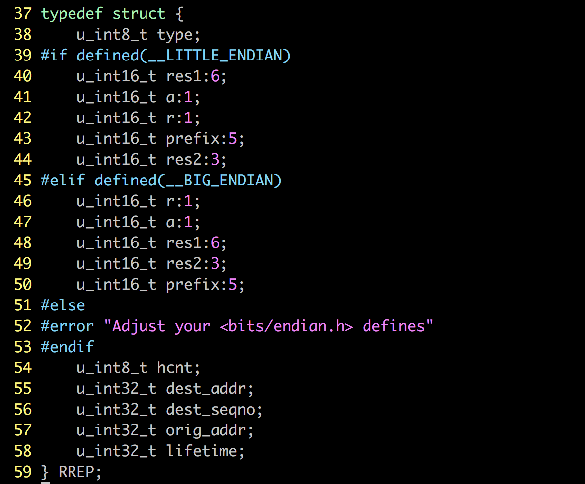
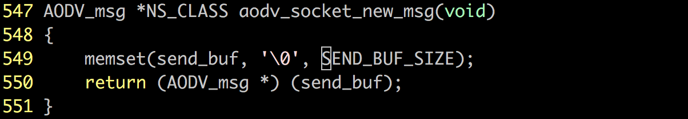
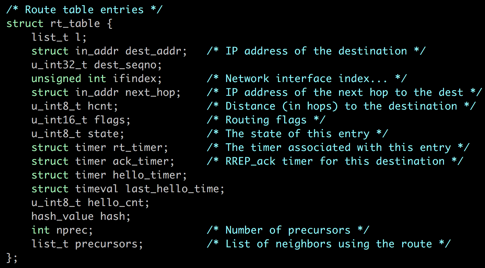
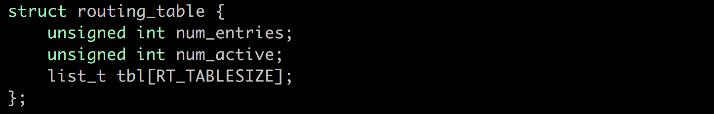

# RREP源码阅读

aodv_rrep.h中主要定义了7个函数：

- 创建RREP
- 创建RREP-ACK
- 发送RREP
- 转发RREP
- RREP的处理
- RREP-ACK的处理

## RREP消息结构

正如rfc里所提及的RREP格式：



RREP结构体被定义为这样的一个结构体：



详细描述参见AODC RFC阅读笔记的RREP部分。

##  创建RREP

定位：aodv_rrep.c

```
52~54: 创建一个 AODV_msg 消息并返回指针，强制转换成RREP *类型。我们来看一下aodv_socket 消息是如何创建的：
```



如上图，它是通过调用系统 `memset` 方法，将 `sendbuf` 全部初始化为`\0`，然后强制转换成AODV_msg消息。

```
55~68: 将RREP结构体的成员进行初始化，值得注意的是，这个函数接收的参数 flags 用来处理 repair 标志和 ack 标志，通过位与。
```

```
72~75: 进行DEBUG输出。
```


## 创建RREP-ACK

RREP-ACK的创建和RREP十分类似，都是创建一个原始的 AODV_msg 然后转换成其指针类型。需要注意的是，RREP-ACK仅仅是为了确定当前连接是双向的，因此，它仅需要包含一个type信息（最多还有存储信息）。

定位：aodv_rrep.c

```
84~87: 声明 RREP-ack 指针；创建 aodv_msg ，返回指针并强制转换成 RREP-ack类型；将结构体的type成员变更为ack类型。
89：DEBUG日志
```


## 处理RREP-ACK

RREP-ACK的处理涉及到路由表，我们先来简单了解一下路由表项在实现中的结构：



`list_t` 是一个包含了前项指针和后项指针的简单结构体；此外路由表项包含了诸多的条目：目的端，目的端序列号，下一跳，跳数，路由标志，表项状态，多种定时器，前项总数，前项列表等，如上所示。

接着来看看路由表：



如上所示，路由表记录表项条目，活跃路由数，并用一个 ` list ` 数组来记录所有项的前项和后项。

定位：aodv_rrep.c

```
98~100: 声明一个 rt_table_t 指针，这里的 rt_table_t 其实就定义为了 rt_table；调用 rt_table_find 函数查找路由表中是否存在和源端ip一致的路由表项，并返回赋值给 rt_table_t 指针。
102~106: 如果没有找到，指针为空，那么在相应警告日志中记录下应该回传ACK的那个节点的ip，程序返回。
107: 如果找到了，在相应DEBUG日志中记录回传ack的节点ip
110: 移除没有超时的timer	// 为什么要移除呢？
```

> 移除定时器的原因将在 time_queue 部分的阅读中解释= =


## RREP消息扩展

源码还提供了对超出 RREP_SIZE 的 rrep 的扩展服务。本文不认为它是重点，随便解释一下：

```
116~119: 显然，小于最大 SIZE 的消息是不需要扩展的。
121: 用原来 rrep 部分和超出的 offset 部分相加得到扩展后的部分
123~124：给 AODV_ext 结构体变量赋值
126: 将参数 data 复制到扩展后的结构中
```


## RREP的发送

发送RREP的时候要做三件事：

- 查看反向路由表
- 检查是否需要ACK
- 更新前项列表