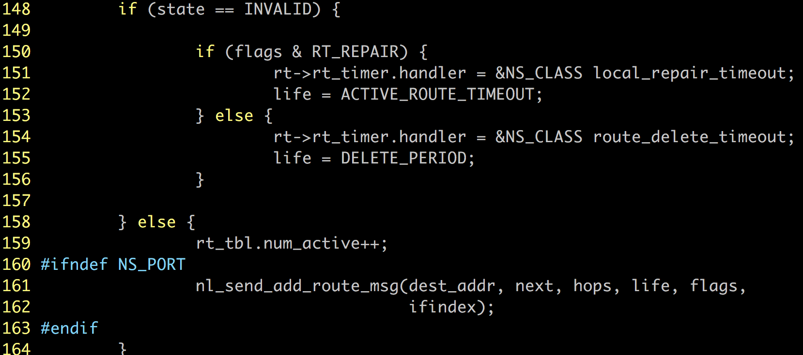

# Routing Table 源码阅读

深吸一口气，然后我们开始读第二长的源码。。

## 主要结构

- Precursor: 用于存储 **路由表** 的活跃路由的邻居。


这里 `neighbor` 代表的是自己的实际地址，`l`是一个`list_t` , 保存两个指针，一个指向前，一个指向后，在这个结构体里指向的应该是代表路由表中其他活跃路由 `list_t` 的指针。

- Routing_table: 用于存储整个节点的路由表


这里保存了所有的表项数目和活跃路由数目，并通过一个list_t数组保存所有的路由的来源和下一跳。

- rt_table: 表示路由表项的各个部分


如上，表项结构很复杂，包含目的端信息，下一跳信息，标志位，状态位，计时器，邻居信息。

- 全局变量 rt_tbl


每个节点拥有一个路由表


## 实现函数

- 路由项的创建
- 路由项的销毁
- 路由项的插入
- 路由项的删除
- 更新路由项的超时时间
- 查找路由表项
- 查找网关
- 路由失效
- 添加前项
- 删除前项


## 路由表初始化

在路由表为空的时候使用这个函数，进行初始化。


之后便生成了一张空表，虽然是空表，不过已经有了基本格式，可以往里插入实际内容了。


## 清空路由表


目的是清空整个路由表，而不仅仅是某个表项。


## 哈希表

为了提高检索效率，将目的地的后6bits作为key，转换成hash值。


## 插入路由表项

根据目的地，下一跳，跳数，序列号，生命周期，状态，标志位，设备网卡号，生成一个路由表项

```c
rt_table_t *NS_CLASS rt_table_insert(struct in_addr dest_addr,
                                      struct in_addr next,
                                      u_int8_t hops, u_int32_t seqno,
                                      u_int32_t life, u_int8_t state,
                                      u_int16_t flags, unsigned int ifindex);
```

### 1. 查重

如果路由表中已经存在我们想要插入表项就不用插入了


101~102: 调用系统函数 `memcpy()` 进行目的地址匹配

### 2. 新建表项


创建好表项以后，根据参数进行赋值，这里仅显示新建代码，初始化过程就省略不写了

### 3. 更新路由表计数

虽然表项还没完全构造好，但是路由表仅仅是存了个指针，可以更新路由表了。


- 141：更新路由表项计数
- 146：将路由表项的 `l` 加入到路由表的 `list_t` 数组中下标为 `index` 的 `list` 中，添加的位置为那个 `list` 的首部后面。相当于队首插入。


### 4. 路由状态处理



- 148~156: 如果路由项无效，根据修复标志设置它的计时器以及生命周期
- 158~164：如果有效，增加路由表活跃路由计数，如果是NS_PORT就给ifindex对应端口发送新增的路由消息

### 5. 网关处理

如果配置了网关，需要更新网关的路由表项的生命周期。


### 6. 生命周期和排队


- 176：设置生命周期
- 180~187：如果有相同目的地的缓存包，在新的路由上发送


## 更新路由表

```c
rt_table_t *NS_CLASS rt_table_update(rt_table_t * rt, struct in_addr next,
                                      u_int8_t hops, u_int32_t seqno,
                                      u_int32_t lifetime, u_int8_t state,
                                      u_int16_t flags);
```

### 1. 更新状态

如果路由之前标记为无效，但现在是活跃的，进行相应更新，但是表项真正状态的改变放在第三步再进行


- 204：更新路由计数
- 206~207：如果之前路由有修复 flag，现在取消它(因为修好了)
- 210~211：向路由表项的接口发送更新信息(这个消息就算不是无效变有效的情况也要发送过去)

### 2. 更新跳数


- 226~235: 如果跳数产生变化，需要更新跳数，移除计时器，同时在更新邻居的时候需要打断链路，以免其他表项会用到它
- 237~240：更新flag，目的端序列号，下一跳，跳数

### 3. 更新超时


- 243~244：更新网关的生命周期
- 248~251：更新表项的超时处理和生命周期
- 255：在这里更新路由的状态

后面还有排队处理，和insert部分一样，略了


## 更新超时

源码提供了很多更新超时的函数

### 根据lifetime和路由表项进行timeout更新

```c
NS_INLINE rt_table_t *NS_CLASS rt_table_update_timeout(rt_table_t * rt,
                                                       u_int32_t lifetime);
```


- 279~286: 如果路由有效，当现在路由的timeout多于新的时候不更新，新的timeout多的时候才进行更新。
- 288：如果路由无效，直接进行更新

### 根据收发数据包更新路由timeout

```c
void NS_CLASS rt_table_update_route_timeouts(rt_table_t * fwd_rt,
                                              rt_table_t * rev_rt);
```

当我们转发一个包的时候，需要更新目的端以及下一跳表项的生命周期


- 306~308: 仅当确定转发路由有效并且只要满足任何一个条件：反馈标志不为0，需要被转发，转发到比下一跳更远的地方，表项的hello计时器被使用，就将转发表项(到目的端的表项)的 timeout 更新为活跃路由timeout
- 313~316：当到下一跳的表项有效，并且满足下一跳的目的端不是转发表项的目的端(说明下一跳之后目的端就不再一致)，则需要更新下一跳的 timeout 为活跃路由的 timeout 

> 可以进一步思考一下313~316在什么情况下会出现

同时，也需要更新反向路由和反向的下一跳路由，因为源和目的之间的路由应该是对称的


## 寻找路由表项

路由表项存储在rt_tbl.tbl这个list里面，下标为目的地址的hash-value, 这里是后6位


359~369：定位到对应hash值的那个链，但是由于这个hash比较简单粗暴，可能存在hash-value一致但是实际dest addr并不相同的情况，不过总之都在这个链上，顺藤摸瓜找到目的地址一样的表项，然后返回。


## 找到网关

```c
rt_table_t *NS_CLASS rt_table_find_gateway();
```

这个函数比较奇怪，也许是和奇特的调用方式有关，它没有传进去任何参数，而是通过两个循环顺序找到第一个设置了网关的的路由，或者是跳数最小的路由表项，然后返回


- 378~380: 顺序查找路由表
- 383~386：将gw更新为跳数最少的，设置了网关标志的表项


## 更新设置了网关的路由

配置了网关的路由比较麻烦，因为通常真正的目的端被保存在了路由表里面，但是节点之间消息的传送需要跨过这一个网关，因此当经过网关的路由表项需要更新时，要先找到网关表项的终点(路由的下一跳)，进行更新。

```c
int NS_CLASS rt_table_update_inet_rt(rt_table_t * gw, u_int32_t life)
```

输入网关表项和生命周期，返回更新的数目


401~413：遍历路由表，找配了网关的有效路由，更新下一跳(因为网关的目的端改变了或者是跳数改变了，所以需要更改使用了网关的路由表项)，并返回更改的计数。


## 路由失效处理

```c
int NS_CLASS rt_table_invalidate(rt_table_t * rt);
```

### 1. 失效标记与处理

不难理解，路由失效以后计时器就没有意义了:


其次，路由的状态要标记为无效，并递减表中活跃路由计数，hello_cnt也应该清零，失效的路由不应继续保存hello信息:


另外，目的端序列号要递增，毕竟此时在这个节点，这个消息是最新最有效的，之前认为这个路由有效而且在此之后想用这个路由的消息都会落败于序列号比较。


### 2. 处理配置了网关的情况

如果失效路由碰巧是网关路由，那么我们需要失效所有使用了这个网关的有效路由。


470: 找到网关。


472~480: 遍历路由表，找到使用了这个网关的所有有效路由。


497~498: 失效使用了网关的路由，并把使用了网关的路由的前项列表都清空。


### 3. 设置路由修复时间

坏了就要修复，给它一个期限：


506~513：如果设置了修复标记，再给路由一个活跃timeout，在这个时间内等待修复，并写入日志


### 4. 设置删除时间

就算路由失效了也并不能立即删除，这和RERR里的设定有关，即使真的失效了并且没有修复，也可能会被用到，需要保留一段时间。

 

517~521: 设置删除timeout，写入日志。


## 删除表项

```c
void NS_CLASS rt_table_delete(rt_table_t * rt);
```

首先从list上移除自己，对于即将被删除的表项来说，所有使用它的邻居节点都不能再继续使用这个表项了，但这个是一个链表，因此需要释放空间，再进行删除。

### 1. list解除


- 534：这是一个比较重要的操作，把自己从某个列表中删除，这个列表是所有目的地址hash-value相同的表项连接而成，所以首先要把自己从这个列表中删除。
- 536：precursors里面存了所有引用这个路由的邻居，因为这个路由要被删了，所以这里需要释放这个列表。

### 2. 活跃终结

如果被删路由还是活跃的，需要在链路上发送删除消息，并减少它的活跃计数。


## 3. 删除


- 546~548: 移除计时器
- 550：减少表项计数
- 552：删除


## 增加表项的使用者

```c
void NS_CLASS precursor_add(rt_table_t * rt, struct in_addr addr);
```

虽然只是新增一个表项使用者，也就是表项的邻居，但是这里的设计十分巧妙，完美地展现了list_t结构，precursor_t结构，以及强制转换的强大和巧妙，请接着看下去。

### 1. 新建一个precursor


- 577: 创建了一个precursor结构此时它是blank状态
- 585：用这个结构的neighbor变量保存参数中传进来的地址

### 2. 加入邻居列表


- 589: 将 `pr->l` 加入路由的邻居列表，实际上是给 `l` 的两个指针都指定了指向。那么`neighbor.c` 里面的强制转换也就豁然开朗了。`precursor` 和 `list` 结构本可以写成一个，但是分开设计可以使路由表项变得更加简洁。它完全可以只简单地存一个纯 `list` 指针，但是当需要查找的时候通过 `list` 到 `precursor` 的强制转换就能够得到邻居的地址，因为加入邻居列表的正是 `precursor` 结构的变量 `l` 。通过这样的办法可以巧妙地分离和再现。
- 590：增加表项；邻居计数。


## 删除表项使用者

```c
void NS_CLASS precursor_remove(rt_table_t * rt, struct in_addr addr);
```

表项的删除没有什么难以理解的地方，遍历表项的邻居，强制转换查看地址，如果地址和目标一致，删除它


- 607~609: 寻找目标邻居
- 613~615：移除邻居列表，减少邻居计数，释放空间。


